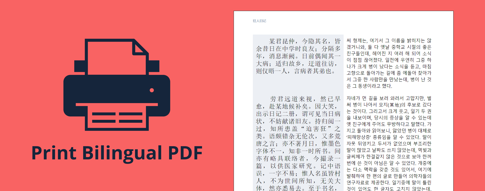

# Print Bilingual PDF

This repository contains JS scripts to open new browser window wherein articles of two aligned source texts are assembled to bilingual document which can be printed into PDF file. The aligned source texts are not just plain texts but have simple and useful specification which can be found [here](https://github.com/bilinguator/bilingual-formats/#source-files-specification).

## Quick start

Add the script tag to your HTML page:

```html
<script type="text/javascript" src="scripts/print_bilingual_pdf.js"></script>
```

Specify `src` attribute if the `print_bilingual_pdf.js` script location changed. Make sure that all JS scripts presented in this repository are located in the same folder. Make sure that the `scripts/print_bilingual_pdf.js` script and the `css/printed_book.css` are co-located as presented in this repository, otherwise specify a correct location of the `printed_book.css` in the `print_bilingual_pdf.js`.

When the script is correctly plugged in to your HTML page, use the function:

```javascript
printBilingualPDF (text1, text2, lang1, lang2,
  mode = 'cols', cover = '', fileName = 'bilingual_book', illustrationsFolder = '/');
```

where `text1`, `text2` - strings containing the full contents of two aligned source texts to be printed;

`lang1`, `lang2` - strings standing for ISO 639 language codes for the two texts; especially important for right-to-left written languages and hieroglyph-based languages;

`mode` - string determining if the constructed bilingual document comprises parallel columns (`'cols'`) or alternating rows (`'rows'`);

`cover` - string containing the address to the book cover; for the best fit, cover should be vertical with proportions 230mm×297mm;

`fileName` - string containing the name of the printed PDF document;

`illustrationsFolder` - string containing the location of the book illustrations if they are.

For creating the document with illustrations, move all the illustrations to one directory, name them as natural arabiс numbers like [here](demonstration/img/illustrations). For more details on illustrations in your bilingual books see the [source texts sepcification](https://github.com/bilinguator/bilingual-formats/blob/main/README.md#book-body).

## Precautions and advices

These codes are browser and texts dependent. In case of big texts with big paragraphs, bugs may occur.

You can change any files, especially CSS (page size, font size and style, etc.) to improve the code execution.

If you don't want to create but you like to read bilingual books, visit [Bilinguator.com](https://bilinguator.com/).
